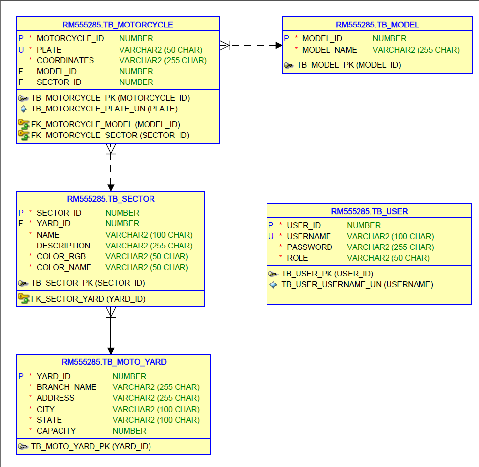

# RESTful API for Mottu Mapping Yard Inventory

# Índice

- [Sobre o Mottu Mapping](#sobre-o-mottu-mapping)
- [Integrantes](#integrantes)
- [Estrutura do projeto](#estrutura-do-projeto)
- [Dependências instaladas](#dependências-instaladas)
- [Diretórios, camadas e arquivos do projeto](#diretórios-camadas-e-arquivos-do-projeto)
- [Endpoints](#endpoints)
- [Documentação de Endpoints no Swagger](#documentação-de-endpoints-no-swagger)
- [Modelo Relacional](#modelo-relacional)
- [Execução do projeto localmente](#execução-do-projeto-em-máquina-local)
- [Deploy no Render](#deploy-no-render)
- [Arquitetura completa](#arquitetura-completa)

## Sobre o Mottu Mapping

Mottu Mapping é uma solução que por meio de um modelo de visão computacional integrado a um sistema de hardware e software, possibilitará um gerenciamento dos pátios da Mottu com
mais agildiade e precisão.

## Integrantes:
- André Geraldi Marcolongo - RM555285 - 2TDSPV
- Felipe Gabriel Lopes Clarindo - RM554547 - 2TDSPF
- Nathália Gomes da Silva - RM554945 - 2TDSPV

## Estrutura do projeto
Aplicação backend desenvolvida em Java utilizando o framework Spring Boot, estruturada com Maven. O sistema gerencia operações de cadastro, edição e exclusão de motos, setores, operadores e pátios, 
integrando funcionalidades de visão computacional para mapeamento de veículos. Os dados são persistidos em banco de dados, com controle de versões e migrações gerenciado pelo Flyway. 

## Dependências utilizadas

```xml
<dependencies>
    <dependency>
        <groupId>org.springframework.boot</groupId>
        <artifactId>spring-boot-starter-data-jpa</artifactId>
    </dependency>
    <!-- Mapper -->
    <dependency>
        <groupId>org.mapstruct</groupId>
        <artifactId>mapstruct</artifactId>
        <version>1.5.5.Final</version>
    </dependency>
    <!-- Data Persistence -->
    <dependency>
        <groupId>com.oracle.database.jdbc</groupId>
        <artifactId>ojdbc11</artifactId>
        <scope>runtime</scope>
    </dependency>
    <!-- Lombok-->
    <dependency>
        <groupId>org.projectlombok</groupId>
        <artifactId>lombok</artifactId>
        <optional>true</optional>
    </dependency>
    <!-- Spring -->
    <dependency>
        <groupId>org.springframework.boot</groupId>
        <artifactId>spring-boot-starter-test</artifactId>
        <scope>test</scope>
    </dependency>
    <dependency>
        <groupId>org.springframework.boot</groupId>
        <artifactId>spring-boot-starter-validation</artifactId>
    </dependency>
    <dependency>
        <groupId>org.springframework.boot</groupId>
        <artifactId>spring-boot-starter-cache</artifactId>
    </dependency>
    <dependency>
        <groupId>org.springframework.boot</groupId>
        <artifactId>spring-boot-devtools</artifactId>
        <scope>runtime</scope>
        <optional>true</optional>
    </dependency>
    <dependency>
        <groupId>org.springframework.boot</groupId>
        <artifactId>spring-boot-starter-web</artifactId>
    </dependency>
    <dependency>
        <groupId>org.springframework.boot</groupId>
        <artifactId>spring-boot-starter-actuator</artifactId>
    </dependency>
    <!-- Security -->
    <dependency>
        <groupId>org.springframework.boot</groupId>
        <artifactId>spring-boot-starter-security</artifactId>
    </dependency>
    <dependency>
        <groupId>io.jsonwebtoken</groupId>
        <artifactId>jjwt-api</artifactId>
        <version>0.12.6</version>
    </dependency>
    <dependency>
        <groupId>io.jsonwebtoken</groupId>
        <artifactId>jjwt-impl</artifactId>
        <version>0.12.6</version>
        <scope>runtime</scope>
    </dependency>
    <dependency>
        <groupId>io.jsonwebtoken</groupId>
        <artifactId>jjwt-jackson</artifactId>
        <version>0.12.6</version>
        <scope>runtime</scope>
    </dependency>
    <!-- Flyway -->
    <dependency>
        <groupId>org.flywaydb</groupId>
        <artifactId>flyway-database-oracle</artifactId>
    </dependency>
    <!-- Swagger -->
    <dependency>
        <groupId>io.swagger.core.v3</groupId>
        <artifactId>swagger-annotations</artifactId>
        <version>2.2.38</version>
    </dependency>
    <dependency>
        <groupId>org.springdoc</groupId>
        <artifactId>springdoc-openapi-starter-webmvc-ui</artifactId>
        <version>2.6.0</version>
    </dependency>
</dependencies>
```

## Diretórios, camadas e arquivos do projeto

```shell
├───src
│   ├───main
│   │   ├───java
│   │   │   └───mottu
│   │   │       └───mapping
│   │   │           └───minified
│   │   │               └───api
│   │   │                   │   MottuMappingApiMinifiedApplication.java
│   │   │                   │
│   │   │                   ├───config
│   │   │                   │       CorsConfig.java
│   │   │                   │       SwaggerConfig.java
│   │   │                   │
│   │   │                   ├───controller
│   │   │                   │       LoginController.java
│   │   │                   │       ModelController.java
│   │   │                   │       MotoController.java
│   │   │                   │       SectorController.java
│   │   │                   │
│   │   │                   ├───dto
│   │   │                   │       CountSectorDTO.java
│   │   │                   │       LoginRequestDTO.java
│   │   │                   │       LoginResponseDTO.java
│   │   │                   │       ModelDTO.java
│   │   │                   │       MotoRequestDTO.java
│   │   │                   │       MotoResponseDTO.java
│   │   │                   │       SectorDTO.java
│   │   │                   │
│   │   │                   ├───mapper
│   │   │                   │       ModelMapper.java
│   │   │                   │       MotoMapper.java
│   │   │                   │       SectorMapper.java
│   │   │                   │
│   │   │                   ├───model
│   │   │                   │       Model.java
│   │   │                   │       Moto.java
│   │   │                   │       MotoYard.java
│   │   │                   │       Sector.java
│   │   │                   │       User.java
│   │   │                   │
│   │   │                   ├───repository
│   │   │                   │       ModelRepository.java
│   │   │                   │       MotoRepository.java
│   │   │                   │       SectorRepository.java
│   │   │                   │       UserRepository.java
│   │   │                   │
│   │   │                   ├───security
│   │   │                   │   │   SecurityConfig.java
│   │   │                   │   │
│   │   │                   │   └───jwt
│   │   │                   │           JwtAuthFilter.java
│   │   │                   │           JwtUtil.java
│   │   │                   │
│   │   │                   └───service
│   │   │                           ModelService.java
│   │   │                           MotoService.java
│   │   │                           SectorService.java
│   │   │                           UserDetailsServiceImpl.java
│   │   │
│   │   └───resources
│   │       │   application.properties
│   │       │
│   │       └───db
│   │           └───migration
│   │                   V1__create_tables.sql
│   │                   V2__insert__users.sql
│   │                   V3__insert_moto_models.sql
│   │                   V4__insert_moto_yards.sql
│   │                   V5__insert_sectors.sql
│   │                   V6__populate_motorcycles.sql
```
## Endpoints

| **Entidade** | **Operação**                                       | **Método** | **URL**                                   | **Descrição** |
|---------------|----------------------------------------------------|-------------|-------------------------------------------|----------------|
| **Sector**    | Listar todos os setores                            | GET         | `/api/sectors`                            | Retorna a lista completa de setores cadastrados. |
| **Model**     | Listar todos os modelos                            | GET         | `/api/models`                             | Retorna todos os modelos de motos disponíveis. |
| **Moto**      | Criar nova moto                                    | POST        | `/api/motos`                              | Cadastra uma nova moto no sistema. |
|               | Listar motos (com filtros e paginação)             | GET         | `/api/motos`                              | Retorna a lista de motos, permitindo filtros e paginação. |
|               | Buscar moto por ID                                 | GET         | `/api/motos/{id}`                         | Retorna os detalhes de uma moto específica pelo seu ID. |
|               | Atualizar moto por ID                              | PUT         | `/api/motos/{id}`                         | Atualiza as informações de uma moto existente. |
|               | Deletar moto por ID                                | DELETE      | `/api/motos/{id}`                         | Remove uma moto do sistema com base no ID. |
|               | Quantidade de motos por setor                      | GET         | `/api/motos/count-by-sector`              | Retorna o total de motos agrupadas por setor. |
| **User**      | Autenticar usuário                                 | POST        | `/login`                                  | Recebe *username* e *password* e retorna um token de autenticação (JWT). |

## Documentação de Endpoints no Swagger

A coleção de APIs está disponível em:  

[Mottu Mapping RESTful on Render - Swagger](https://mottu-mapping-restful-4demo.onrender.com/swagger-ui/index.html)

## Modelo Relacional



## Execução do projeto em máquina local

``` bash
git clone https://github.com/andremarko/mottu-mapping-restful-4demo
cd mottu-mapping-restful-4demo
```
### No diretório /src/resources crie:

```bash
touch env.properties
```
Dentro do env.properties insira as seguintes variáveis e seus respectivos valores, por exemplo:

**Configurado para persistir em Banco de dados Oracle**

```
JWT_SECRET=suaJWTSecret
EXPIRATION_TIME=36000000 (ou qual preferir)
ORACLE_JDBC_CONNECTION_STRING=jdbcString
ORACLE_USERNAME=oracleUsername
ORACLE_PASSWORD=oraclePassword
```
### Após criação do env.properties, na raíz do projeto, execute:

```
mvn spring-boot:run
```

### Acesse via navegador: `[host]:8080/swagger`

## Deploy no Render

O backend do sistema Mottu Mapping encontra-se implantado na plataforma Render, acessível publicamente pelo endpoint:

🔗 https://mottu-mapping-restful-4demo.onrender.com

Esse serviço hospeda a API RESTful desenvolvida em Java com Spring Boot, responsável por gerenciar os cadastro de motos, 
e atender às requisições do aplicativo mobile integrado

## Arquitetura completa

